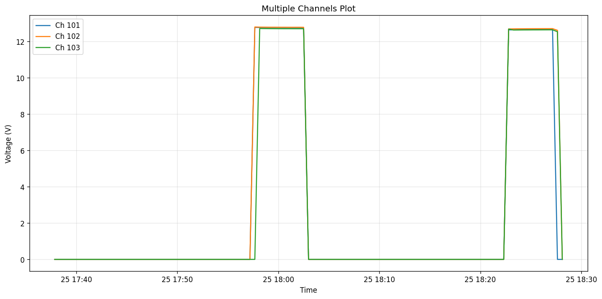
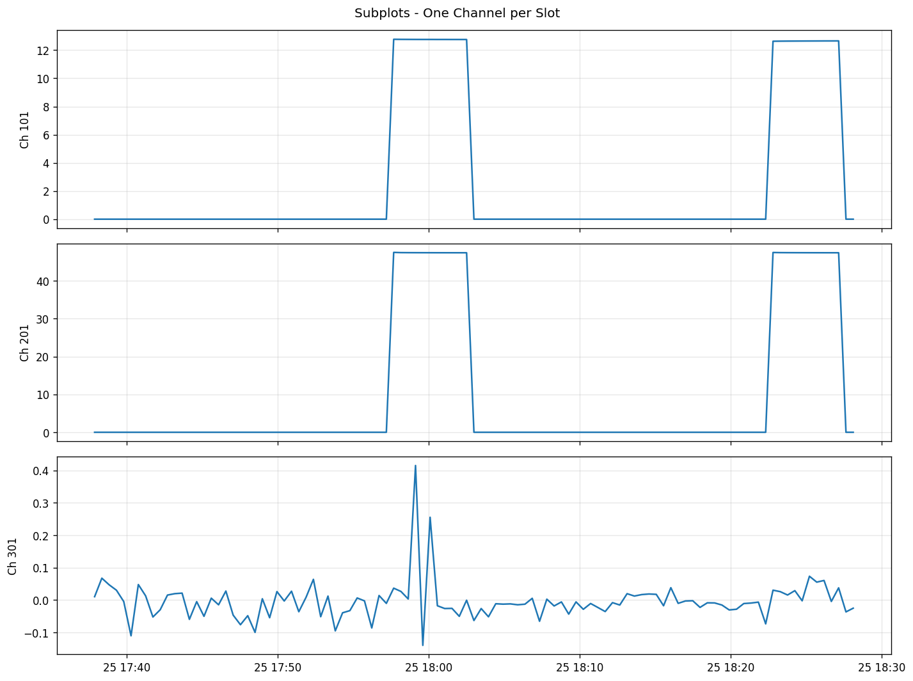
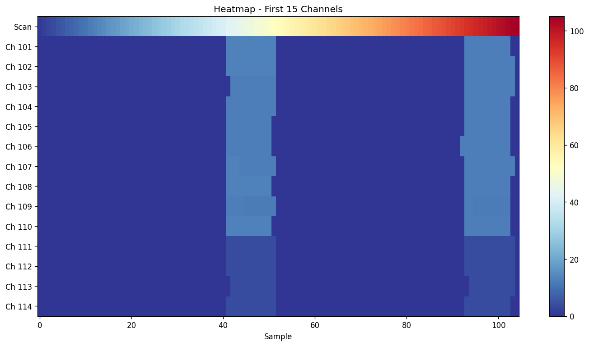
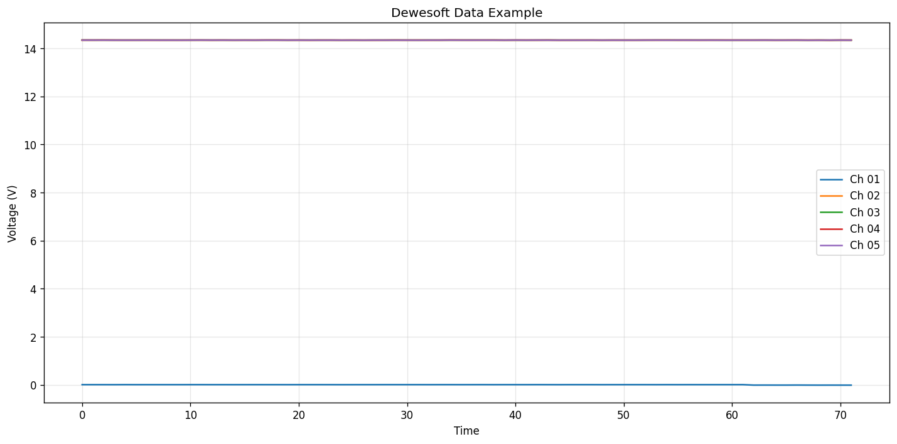

# Examples

This page shows common use cases with code and output examples.

## Basic Plot

Plot multiple channels on the same graph:

```python
from labdataplot import DataLoader, Plotter

loader = DataLoader('measurement.xlsx')
plotter = Plotter(loader)

fig, ax = plotter.plot(
    ['101 (VDC)', '102 (VDC)', '103 (VDC)'],
    title='Multiple Channels Plot',
    ylabel='Voltage (V)'
)
plotter.show()
```



## Subplots

Create separate plots for each channel stacked vertically:

```python
fig, axes = plotter.subplots(
    ['101 (VDC)', '201 (VDC)', '301 (VDC)'],
    rows=3,
    title='Subplots - One Channel per Slot'
)
```



## Grid Layout

Arrange multiple plots in a grid:

```python
fig, axes = plotter.subplots(
    ['ch1', 'ch2', 'ch3', 'ch4'],
    rows=2,
    cols=2,
    title='Grid Layout Example'
)
```


## Quick View

Quickly visualize the first N channels:

```python
# Show first 6 channels
fig, axes = plotter.quick(6)
```


## Heatmap

Visualize all channels as a heatmap:

```python
fig, ax = plotter.heatmap(
    columns=loader.columns[:15],
    title='Heatmap - First 15 Channels'
)
```



## Dewesoft Data

Loading and plotting Dewesoft Datalogger files:

```python
loader = DataLoader('datalogger_export.xlsx')
plotter = Plotter(loader)

fig, ax = plotter.plot(
    loader.columns[:5],
    title='Dewesoft Data Example',
    ylabel='Voltage (V)'
)
```



## Customizing Plots

### Change Line Style and Color

```python
fig, ax = plotter.plot(
    'ch1',
    color='red',
    linestyle='--',
    linewidth=2,
    marker='o',
    markersize=3
)
```

### Add Threshold Lines

```python
fig, ax = plotter.plot('ch1', title='With Threshold')

# Add horizontal threshold line
ax.axhline(y=5.0, color='red', linestyle='--', label='Upper Limit')
ax.axhline(y=-5.0, color='red', linestyle='--', label='Lower Limit')
ax.legend()

plotter.show()
```

### Zoom to Specific Region

```python
fig, ax = plotter.plot('ch1')

# Zoom to specific time/sample range
ax.set_xlim(100, 200)
ax.set_ylim(0, 15)

plotter.show()
```

### Save High-Resolution Figure

```python
fig, ax = plotter.plot('ch1', title='Publication Quality')

# Save as PNG with high DPI
plotter.save('figure.png', dpi=300)

# Save as PDF (vector)
plotter.save('figure.pdf')

# Save as SVG (vector, editable)
plotter.save('figure.svg')
```

## Working with Data Directly

### Access Raw DataFrame

```python
loader = DataLoader('data.xlsx')

# Get full DataFrame
df = loader.data

# Statistical summary
print(df.describe())

# Filter data
high_values = df[df['ch1'] > 10]

# Calculate custom metrics
mean_values = df[loader.columns].mean()
print(mean_values)
```

### Find Specific Channels

```python
# Find channels by pattern
slot1_channels = loader.get_channel(r'^10')  # 101-120
slot2_channels = loader.get_channel(r'^20')  # 201-220

# Find by suffix
first_channels = loader.get_channel(r'_01$')  # NN_01, etc.
```

### Export Processed Data

```python
# Filter and export
df = loader.data
selected = df[['Time', 'ch1', 'ch2', 'ch3']]

# Save to new file
selected.to_csv('processed_data.csv', index=False)
selected.to_excel('processed_data.xlsx', index=False)
```

## Complete Analysis Script

```python
from labdataplot import DataLoader, Plotter
import matplotlib.pyplot as plt

# Load data
loader = DataLoader('test_data.xlsx')

print(f"File: {loader.info.filename}")
print(f"Equipment: {loader.info.equipment}")
print(f"Date: {loader.info.acquisition_date}")
print(f"Channels: {len(loader.columns)}")
print(f"Samples: {len(loader.data)}")

# Quick statistics
df = loader.data
print("\nStatistics for first 3 channels:")
print(df[loader.columns[:3]].describe())

# Create visualization
plotter = Plotter(loader, figsize=(14, 8))

# Main overview
fig, axes = plotter.quick(8)
plt.savefig('overview.png', dpi=150)

# Detailed view of interesting channels
fig, ax = plotter.plot(
    loader.columns[:3],
    title='Main Channels',
    ylabel='Voltage (V)'
)

# Add statistics
for i, col in enumerate(loader.columns[:3]):
    mean = loader[col].mean()
    ax.axhline(y=mean, linestyle=':', alpha=0.5)

plt.savefig('detailed.png', dpi=150)
plt.show()
```
